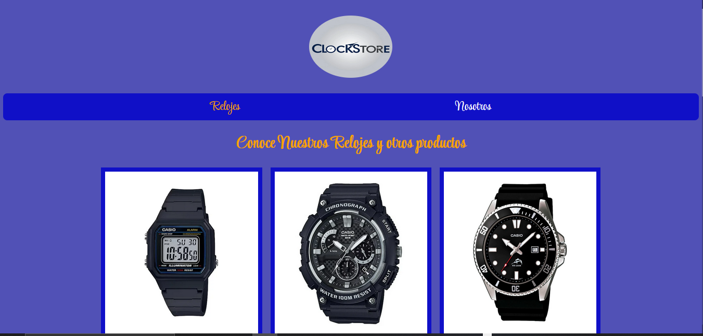
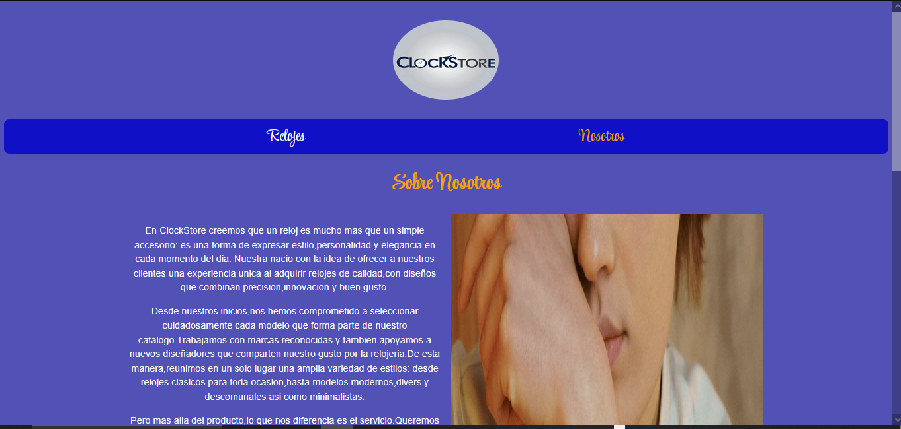
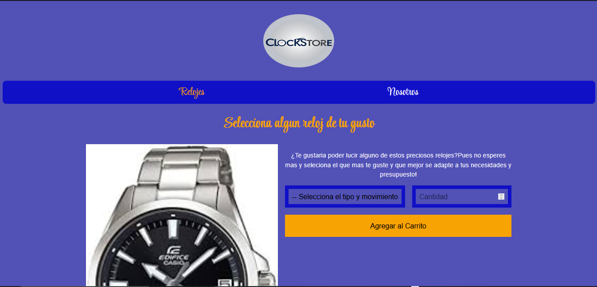

# Tienda Virtual de Relojes (ClockStore)

**Descripcion**

Este proyecto consiste en una tienda virtual moderna y responsiva dedicada a la venta de relojes de gama media y baja.Su proposito es ofrecer una experiencia de compra visualmente atractiva, funcional y adaptable a cualquier dispositivo.

## Caracteristicas principales
- Diseño **limpio, elegante y adaptable** a todos los tamaños de pantalla.

- Desarrollado con **HTML5**, **CSS3** y el enfoque de **BEM** (Bloques,elementos y modificadores)

- Interfaz intuitiva y navegacion fluida.
- Estructura organizada con **Grid y Flexbox**.
- Metadatos optimizados para SEO y redes sociales.
- Compatible con navegadores modernos.

## Objetivo del proyecto
Demostrar las habilidades de diseño y desarrollo front-end aplicadas a una tienda online profesional aun sin metodo de pago pero uniendo estetica,rendimiento y usabilidad.

## Tecnologias empleadas 
- **HTML5**
- **CSS3**
- **Grid y Flexbox**

## Estructura del Proyecto

```
tiendaestatica/
    ├img/
    ├styles/
    ├index.html 
    ├relojes.html
    └README.md
```
## Descripcion general del proyecto 

- **index.html** Pagina principal con la presentacion de la tienda y una galeria de todos nuestros productos

- **nosotros.html** Informacion de la empresa,mision y vision.

- **relojes.html** Seccion de Carrito de compras pero sin metodo de pago

- **styles.css** Contiene los estilos CSS para el diseño de la tienda

- **img** Esta carpeta contiene las imagenes y logotipos del proyecto en diferentes formatos compatibles

## Capturas de pantalla

### Pagina de Inicio 


### Pagina ("Sobre nosotros") 


### Carrito de Compras


### Desarrollado por

AbelVOrtuno para Spiral Web Studio 

Diseño y desarrollo web moderno enfocado en crear experiencias digitales funcionales,atractivas y optimizadas.

Proyecto de demostracion para portafolio profesional.